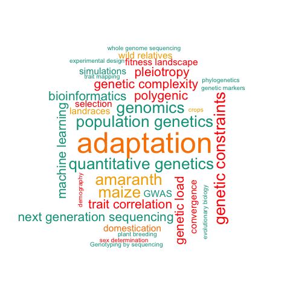

```{r echo=FALSE,eval=FALSE}
shiny::includeHTML("custom_header.html")
```


Welcome to the soon-to-be Stetter lab in the [Botanical Institute](http://www.botanik.uni-koeln.de/1634.html?&L=1) at the [University of Cologne](https://www.uni-koeln.de/). 
We are interested in crop evolution and adaptation. We study the incomplete domestication of the South American pseudo-cereal, amaranth, and the domestication and cultivation history of maize. We use population and quantitative genetic methods to understand how wild plants became crops and how these crops spread across the globe. 

Read more about our [research](research.html) and who we are on this site. If you like what we do and would like to join the lab please contact [Markus](mailto:mgstetter@gmail.com) to find out more about openings and possibilities to apply for fellowships.





```{r,echo=FALSE, eval=T}


library(htmltools)
thumbnail <- function(title, img, href, caption = TRUE) {
  div(class = "col-sm-3",
      a(class = "thumbnail", title = title, href = href,
        img(src = img),
        div(class = ifelse(caption, "caption", ""),
          ifelse(caption, title, "")
        )
      )
  )
}
```

```{r, echo=FALSE, eval=F}
#thumbnail("Twitter", "own_images/me_2016.jpg", "https://twitter.com/mgstetter")
thumbnail("Science", "own_images/hyp_genome_fastAnc_with_BM.png", "science.html")
thumbnail("Breeding", "own_images/DSC_0020.jpg", "breeding.html")
thumbnail("Programming", "own_images/phenotype.png", "programming.html")

```


<script>
  (function(i,s,o,g,r,a,m){i['GoogleAnalyticsObject']=r;i[r]=i[r]||function(){
  (i[r].q=i[r].q||[]).push(arguments)},i[r].l=1*new Date();a=s.createElement(o),
  m=s.getElementsByTagName(o)[0];a.async=1;a.src=g;m.parentNode.insertBefore(a,m)
  })(window,document,'script','https://www.google-analytics.com/analytics.js','ga');

  ga('create', 'UA-96594188-1', 'auto');
  ga('send', 'pageview');

</script>

