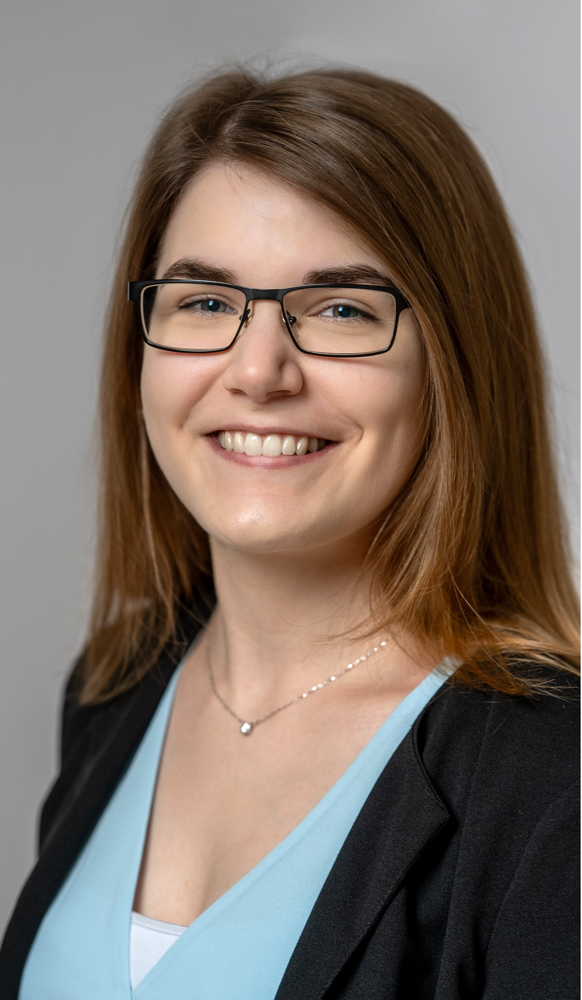
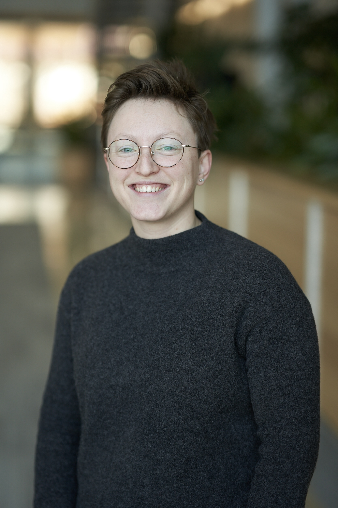
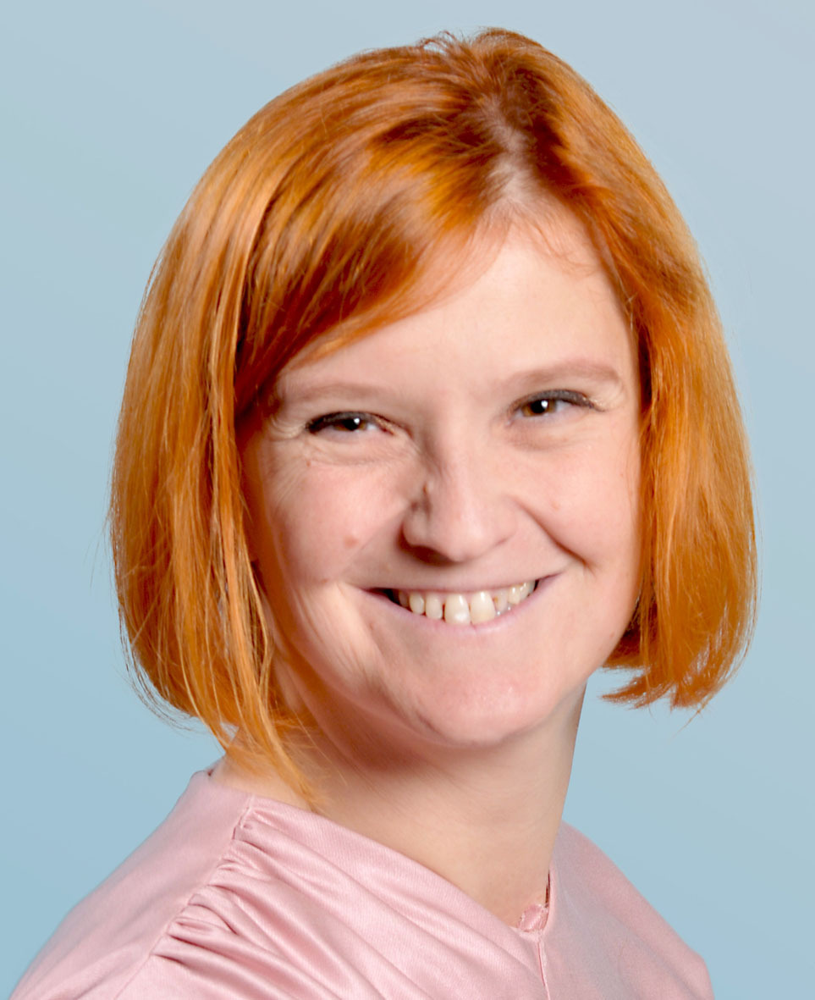
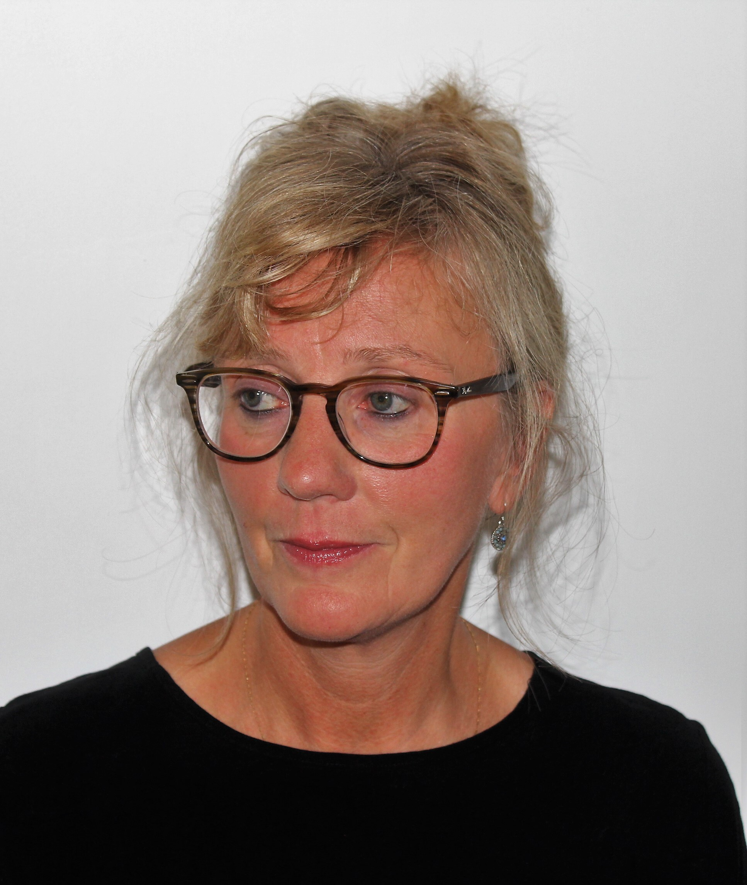
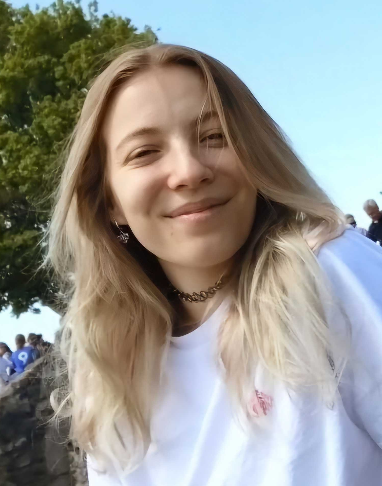
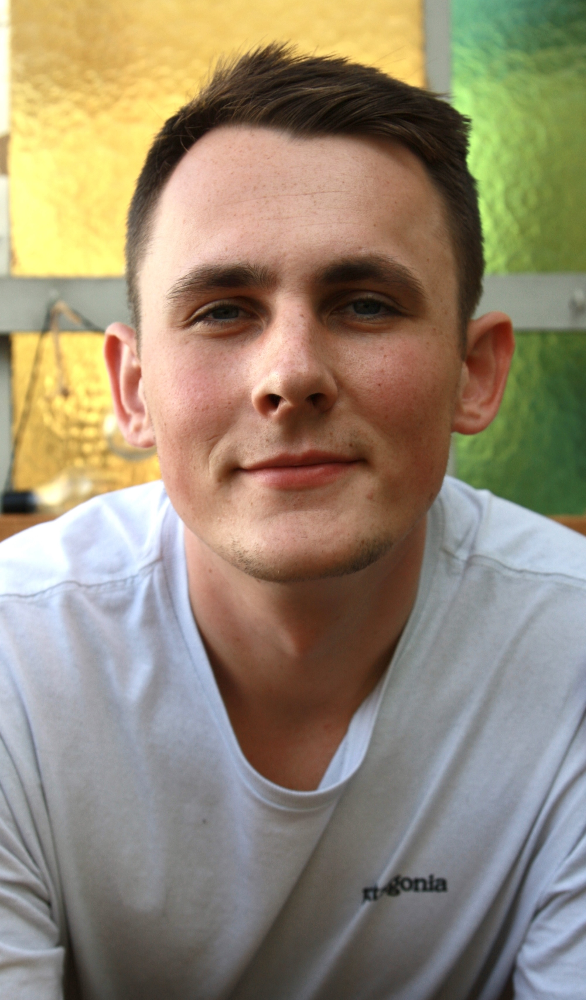
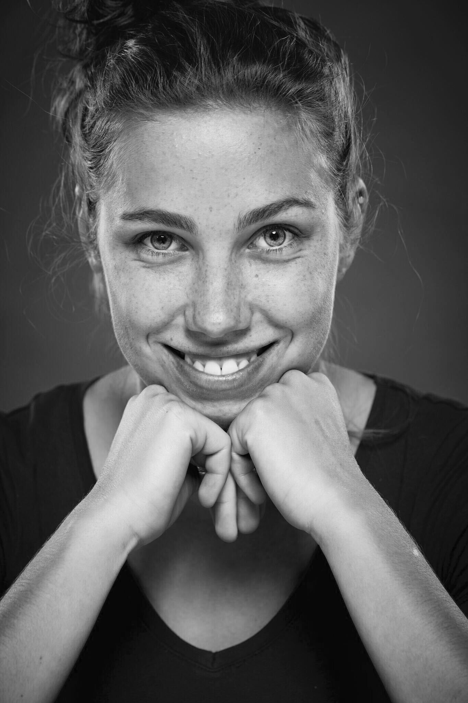

Please contact us if you are interested in joining the lab.

<!-- break -->
 
<!-- break -->

**Markus Stetter** 

Markus is group leader in the Institute for Plant Sciences at the University of Cologne  [read more](about.html)  

<!-- break -->
 
 
 
<!-- break -->

## Postdocs

**Maxime Kadner** 

Maxime studies the molecular changes that converted wild plants to crops using grain amaranth as a model. 
<!-- break -->
 
 
 
 
 
 
 

**Hanna Marie Schilbert** 

Hanna studies how pleiotropy evolves as part of [TRR 341](https://trr341.uni-koeln.de/). 
<!-- break -->
 
 
 
 
 
 
 

**Akanksha Singh** 

Akanksha studies the introduction history of grain amaranth to India and the sources of adaptive alleles. 
<!-- break -->
 
 
 
 
 
 
 

**Margarita Takou** 

Margarita studies polygenic selection in an experimental population of European maize. 
<!-- break -->
 
 
 
 
 
 
 
 
 

## PhD candidates

**Corbinian Graf** 

Corbinian is a PhD student studying the genetic landscape of grain amaranth and how it changed during the repeated domestication. 
<!-- break -->
 
 
 
 
 
 
 

**Ella Ludwig** 

Ella studies stuctural variation in amaranth.
<!-- break -->
 
 
 
 
 
 
 

**Susanne Vollmer** 

Susanne is a PhD student and part of the CEPLAS graduate school in collaboration with the [Hensel lab at HHU](https://www.ceplas.eu/en/research/people/dr-goetz-hensel). Susanne advances various molecular methods for amaranth and dissects the regulation of betalain pigments.
<!-- break -->
 
 
 
 
 
 
 

**Tom Winkler** 

Tom is a PhD student studying amaranth domestication and the involvement of transcriptomic changes in metabolic pathways
<!-- break -->
 
 
 
 
 
 
 

**Yuna Zhang** 

Yuna studies polygenic adaptation and the evolution of trait syndromes as part of the [TRR 341](https://trr341.uni-koeln.de/).

<!-- break -->
 
 
 
 
 
 
 

## Office

**Katharina Borowski** 

Katharina runs the office and does the paper work magic
<!-- break -->
 
 
 
 
 
 
 

## Lab managers

**Evelin Fahle** 

Evelin runs our large scale applications and does pipetting magic
<!-- break -->
 
 
 
 
 
 
 

**Leia Mijatovic** 

Leia runs the cloning and molecular analysis in the wet lab and does pipetting magic
<!-- break -->
 
 
 
 
 
 
 

<!-- break

-->

## BSc Thesis

**Bartlomiej Chachula** 

Bartlomiej seed color change during amaranth domestication using AI driven seed phenotyping.
<!-- break -->
 
 
 
 
 
 
 

**Maria Rodriguez** 

Maria studie betalain accumulation and its fitness consequences under stress in amaranth.
<!-- break -->
 
 
 
 
 
 
 

**Carlotta Sehl** 

Carlotta develops grafting as tool for genome editing in amaranth

<!-- break -->
 
 
 
 
 
 
 

## Student helpers and interns

**Fernanda Daniela Giampaoli** 

Fernanda helps with wet lab duties.
<!-- break -->
 
 
 
 
 
 
 

**Sophie Feyerabend** 

Sophie helps with plant work and field experiments.
<!-- break -->
 
 
 
 
 
 
 

<!-- break 

**Anny Garces** 

Anny is a CEPLAS rotation student exploring structural variation in grain amaranth

 
 
 
 
 
 
 

**Ahad Kazmi** 

Ahad is a biochemistry master student wroking on long read sequencing in amaranth.
 
 
 
 
 
 
 

 

-->

## Joining the lab

**Maybe you?** 

Contact us if you are interested in joining the lab. [contact us](mailto:mgstetter@gmail.com) 

<!-- break -->
 
 
 
 
 
<!-- break -->

## Lab alumni
- Sophie Schreiner (BSc student)
- Tom Winkler (BSc, MSc student)
- José Goncalves-Dias (PhD student)
- Julio Martinez (MSc student)
- Kerstin Schulz

## Past Visitors
- Cátia José Neves
- Sabarna Bhattacharyya
- Kerstin Schulz
- Susanne Vollmer
- Tatiana Stead
- Kumsal Ecem Çolpan
- Laura Merx
- Krzysztof Pukacz 
- Anny Garces
- Nguyen Quang Huy
- Roger Antonio Sulub Tun 
- Luca Weber

<!-- Google tag (gtag.js) -->

