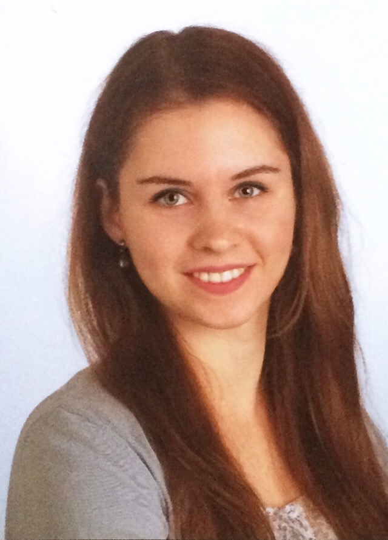

Please contact us if you are interested in joining the lab.

<!-- break -->
 
<!-- break -->

**Markus Stetter** 

Markus is a group leader in the Botanical Institute of the University of Cologne  [read more](about.html)  

<!-- break -->
 
 
 
 
 
<!-- break -->

**José Dias** 

José is a PhD student studying introgression during grain amaranth domestication and its influence on the crop's genome biology. 
<!-- break -->
 
 
 
 
 
 
 

**Sophie Schreiner** 

Sophie is a biology undergraduate student doing her thesis research in the lab. She is studying the molecular control of seed color variation in amaranth.

<!-- break -->
 
 
 
 
 
 
 

<!-- break -->

**Tom Winkler** 

Tom is a biology undergraduate student conducting his thesis research in the lab. He is identifying transcription factor families in _Amaranthus_ and related species.
<!-- break -->
 
 
 
 
 
 
 

<!-- break -->

**Maybe you?** 

Contact me if you are interested in joining the lab. [contact me](mailto:mgstetter@gmail.com) 

<!-- break -->
 
 
 
 
 
<!-- break -->

## Past Visitors
- Cátia José Neves
- Sabarna Bhattacharyya

<!-- Global site tag (gtag.js) - Google Analytics -->

