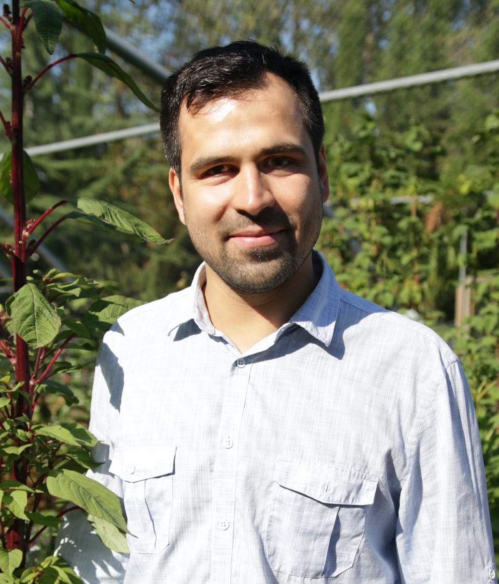
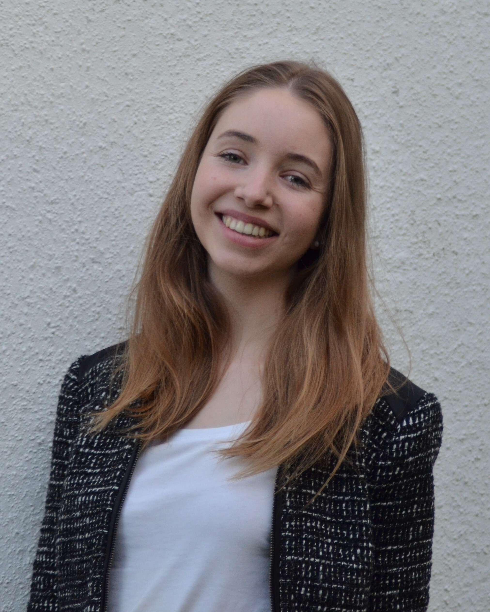

Please contact us if you are interested in joining the lab.

<!-- break -->
 
<!-- break -->

**Markus Stetter** 

Markus is group leader in the Institute for Plant Sciences at the University of Cologne  [read more](about.html)  

<!-- break -->
 
 
 
<!-- break -->

## Postdoc

**Akanksha Singh** 

Akanksha studies the introduction history of grain amaranth to India and the sources of adaptive alleles. 
<!-- break -->
 
 
 
 
 
 
 

## PhD students

**Corbinian Graf** 

Corbinian is a PhD student studying the genetic landscape of grain amaranth and how it changed during the repeated domestication. 
<!-- break -->
 
 
 
 
 
 
 

**José Dias** 

José is a PhD student studying gene flow between grain amaranth species and their wild relatives to reconstruct the domestication history of the crop. 
<!-- break -->
 
 
 
 
 
 
 

**Kerstin Schulz** 

Kerstin is a PhD student and part of the CEPLAS graduate school. Kerstin employs ancestral recombination graphs to study the evolution of maize 
<!-- break -->
 
 
 
 
 
 
 

**Susanne Vollmer** 

Susanne is a PhD student and part of the CEPLAS graduate school in collaboration with the [Hensel lab at HHU](https://www.ceplas.eu/en/research/people/dr-goetz-hensel). Susanne advances various molecular methods for amaranth and dissects the regulation of seed color adaptation.
<!-- break -->
 
 
 
 
 
 
 

## Lab manager

**Roswitha Lentz** 

Roswitha runs the wet lab and does the pipetting magic
<!-- break -->
 
 
 
 
 
 
 

## Master students

**Tom Winkler** 

Tom is a master student studying the the amaranth transcriptome and the involvement of transcriptomic changes in metabolic pathways
<!-- break -->
 
 
 
 
 
 
 

**Julio Martinez** 

Julio is a master student wroking on the molecular validation of domestication genes in grain amaranth and the conservation of the MBW regulation network.
<!-- break -->
 
 
 
 
 
 
 

<!-- break

-->
## Student helpers and interns

**Leonie Eberhard** 

Leonie is a student helper in the lab evaluating the phenotypic diversity of a grain amaranth reference population.
<!-- break -->
 
 
 
 
 
 
 

**Laura Merx** 

Laura is a CEPLAS rotation student working on large structural variants in amarnath
<!-- break -->
 
 
 
 
 
 
 

<!-- break 
**Ahad Kazmi** 

Ahad is a biochemistry master student wroking on long read sequencing in amaranth.
 
 
 
 
 
 
 

 

-->

## Joining the lab

**Maybe you?** 

Contact us if you are interested in joining the lab. [contact us](mailto:mgstetter@gmail.com) 

<!-- break -->
 
 
 
 
 
<!-- break -->

## Lab alumni
- Sophie Schreiner (BSc student)
- Tom Winkler (BSc student)

## Past Visitors
- Cátia José Neves
- Sabarna Bhattacharyya

<!-- Global site tag (gtag.js) - Google Analytics -->

