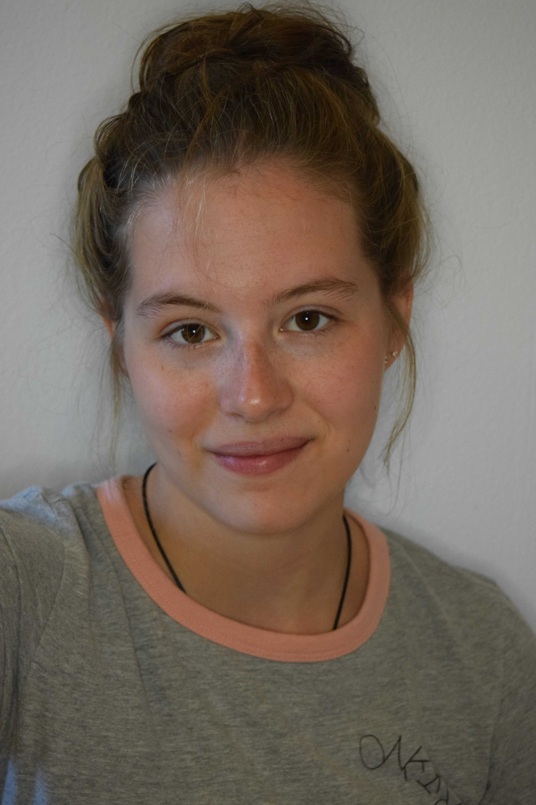

Please contact us if you are interested in joining the lab.

<!-- break -->
 
<!-- break -->

**Markus Stetter** 

Markus is group leader in the Institute for Plant Sciences at the University of Cologne  [read more](about.html)  

<!-- break -->
 
 
 
<!-- break -->

## Postdoc

**Akanksha Singh** 

Akanksha studies the introduction history of grain amaranth to India and the sources of adaptive alleles. 
<!-- break -->
 
 
 
 
 
 
 

**Margarita Takou** 

Margarita studies polygenic selection in an experimental population of European maize. 
<!-- break -->
 
 
 
 
 
 
 

## PhD candidates

**Corbinian Graf** 

Corbinian is a PhD student studying the genetic landscape of grain amaranth and how it changed during the repeated domestication. 
<!-- break -->
 
 
 
 
 
 
 

**Kerstin Schulz** 

Kerstin is a PhD student and part of the CEPLAS graduate school. Kerstin employs ancestral recombination graphs to study the evolution of maize 
<!-- break -->
 
 
 
 
 
 
 

**Susanne Vollmer** 

Susanne is a PhD student and part of the CEPLAS graduate school in collaboration with the [Hensel lab at HHU](https://www.ceplas.eu/en/research/people/dr-goetz-hensel). Susanne advances various molecular methods for amaranth and dissects the regulation of seed color adaptation.
<!-- break -->
 
 
 
 
 
 
 

**Tom Winkler** 

Tom is a PhD student studying amaranth domestication and the involvement of transcriptomic changes in metabolic pathways
<!-- break -->
 
 
 
 
 
 
 

**Yuna Zhang** 

Yuna studies polygenic adaptation and the evolution of trait syndromes as part of the TRR 341 

<!-- break -->
 
 
 
 
 
 
 

## Lab manager

**Roswitha Lentz** 

Roswitha runs the wet lab and does the pipetting magic
<!-- break -->
 
 
 
 
 
 
 

<!-- break

-->

## Student helpers and interns

**Vivien Pluekthun** 

Vivien studies genetic determinants of germination in grain amaranth.
<!-- break -->
 
 
 
 
 
 
 

**Emily Rywelski** 

Emily works on pollen nucleous extraction and cell sorting.
<!-- break -->
 
 
 
 
 
 
 

**Jan Krause** 

Jan studies the diversity of Cetral American grain amaranth.
<!-- break -->
 
 
 
 
 
 
 

<!-- break 

**Anny Garces** 

Anny is a CEPLAS rotation student exploring structural variation in grain amaranth

 
 
 
 
 
 
 

**Ahad Kazmi** 

Ahad is a biochemistry master student wroking on long read sequencing in amaranth.
 
 
 
 
 
 
 

 

-->

## Joining the lab

**Maybe you?** 

Contact us if you are interested in joining the lab. [contact us](mailto:mgstetter@gmail.com) 

<!-- break -->
 
 
 
 
 
<!-- break -->

## Lab alumni
- Sophie Schreiner (BSc student)
- Tom Winkler (BSc, MSc student)
- José Goncalves-Dias (PhD student)
- Julio Martinez (MSc student)

## Past Visitors
- Cátia José Neves
- Sabarna Bhattacharyya
- Kerstin Schulz
- Susanne Vollmer
- Tatiana Stead
- Kumsal Ecem Çolpan
- Laura Merx
- Krzysztof Pukacz 
- Anny Garces
- Nguyen Quang Huy
- Roger Antonio Sulub Tun 

<!-- Google tag (gtag.js) -->

