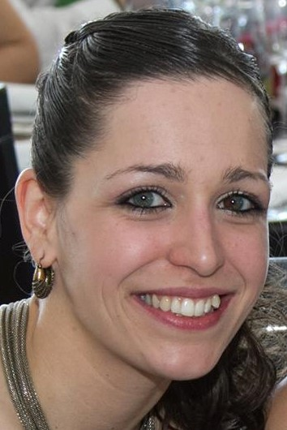

Please contact us if you are interested in joining the lab.

<!-- break -->
 
<!-- break -->

**Markus Stetter** 

Building a lab and trying to do cool science  [read more](about.html)  

<!-- break -->
 
 
 
 
 
<!-- break -->

**Cátia José Neves** 

Cátia is visting the lab to study the evolution of diocey in Amaranthus
<!-- break -->
 
 
 
 
 
 
 

<!-- break -->

**Maybe you?** 

Contact me if you are interested in joining the lab. [contact me](mailto:mgstetter@gmail.com) 

<!-- break -->
 
 
 
 
 
<!-- break -->

<!-- Global site tag (gtag.js) - Google Analytics -->

