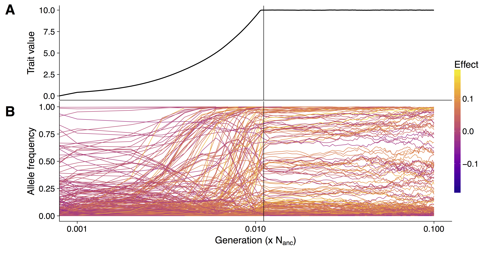
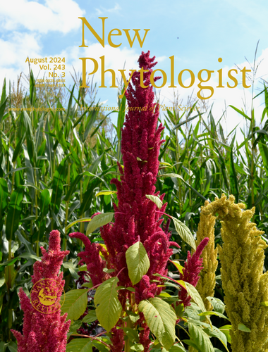
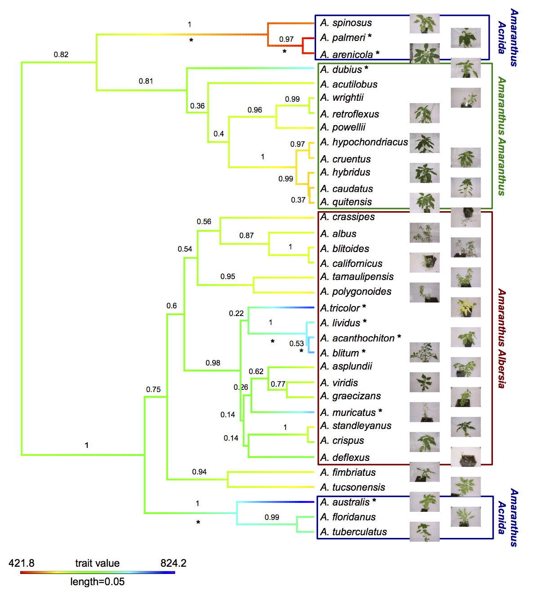
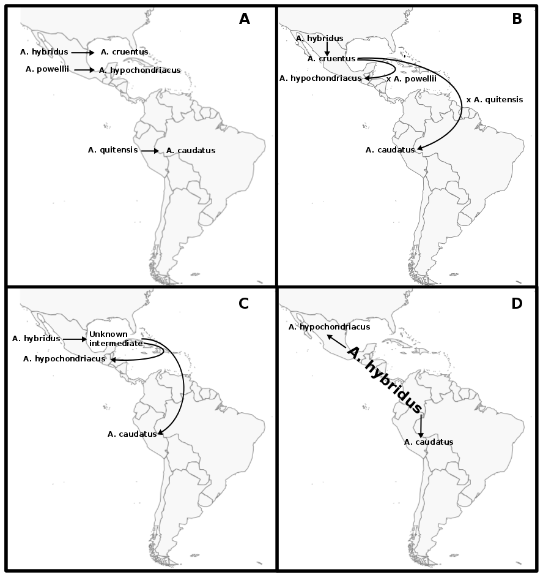

&nbsp;

## Crop evolution
Crop evolution combines the domestication of wild plants and the consecutive adaptation of crops to new enviromnemt outside of their ancestors origin during their spread across the globe.
The domestication of crops was the foundation for modern societies and has taken place across the globe over the last 10,000 years. Humans selected consciously and unconsciously for traits that made wild plants more favourable for human use.
The strong selection transformed a number of common traits across species, such as reduced seed shattering, increased seed size, changed seed color, and modified plant architecture. Together these traits are referred to as the domestication syndrome. 
While almost 2,000 have been cultivated in human history, only few crops are fully domesticated, while others behave more like wild plants. This spectrum of how well adapted to our agroecological environment a plant is and the fact that we (often) know the ancestor of the crop, make the process of domestication an ideal model to study plant evolution and test hypotheses of how organisms adapt to their environment.

The lab studies crops along the spectrum of domestication, with the maybe strongest domesticated crop, maize on the one hand, and the only partially domesticated grain amaranth on the other hand, to understand how plants adapt and what hinders them to adapt.


## Polygenic adaptation

How adaptation proceeds is a fundamental question in evolutionary genetics.
While it has been assumed for a long time that plants adapt mostly via few mutation in key genes, it is now well appreciated that adaptation and evolution depends on a complex network of factors.
These include new mutations, standing genetic variation, and a varying number of genes and regulatory elements.
We are interested in understanding how adaptation works on the genomic level and in particular how polygenic adaptation of traits, controlled by hundreds of loci of small effects can lead strong phenotypic adaptation by minor shifts in allele frequencies and how this changes genetic patterns.
Although well studied traits such as human height, bristle number in Drosophila and grain yield in crops have been identified to follow a polygenic pattern, the genetic architecture of quantitative trait adaptation is not well understood.
We are interested in employing machine learning methods to detect polygenic adaptation in population scale genomic data. We use forward in time simulations to predict the behaviour of real populations under varying scenarios.
Understanding how populations adapt to changing environments is essential to be able to breed better crops for changing climate and to protect wild populations from extinction.




Crop domestication is a well-suited model to study polygenic adaptation, because strong selection shaped the phenotype of crops in evolutionary short time.
Additionally, for many crops, such as maize, phenotype and genotype data is available for a large number of individuals over many generations.


## Evolution of pathway replacement



Novel traits can provide fitness advantages and drive evolution. New specialised metabolites are traits that arose in different plant lineages, and even replaced existing metabolites. Why, and how almost universal metabolic pathways can be replaced in entire groups of species by biochemically distinct pathways without persistence of any species producing both metabolites remains unknown. 

The replacement of the widely conserved red pigment anthocyanin by the biochemically distinct betalains offers a unique opportunity to understand the integration of novel traits into existing regulatory systems. Notably, no plant species producing both anthocyanins and betalains has yet been identified, but both show similar environmental responses. 
We study the evolution of betalain pigments in a multi-scale apporach.


# Our models

## Domestication genomics of amaranth

The genus Amaranthus comprises several crop species that are potentially only partially domesticated. Additionally, grain amaranth seeds have a high nutritional value and the crop has high potential to contribute to human nutrition in the future. Together, these characteristics make the genus, and in particular grain amaranth, interesting models to study domestication, genome evolution and crop adaptation.




Although grain amaranth has been cultivated for over 5,000 years and in the same regions as maize and other domesticated crops, the domestication syndrome is only weakly pronounced. Grain amaranth has tiny seeds that shatter and cultivated amaranth species do not have lower genetic diversity than their wild ancestors.
Therefore, the genomic and phenotypic signatures of amaranth domestication differ from other, highly domesticated crops that originated from a single domestication. In contrast, the history of cultivated amaranth may include multiregional, multiple and incomplete domestication with frequent and ongoing gene flow from sympatric relatives.


```{r,eval=FALSE,include=FALSE}
<div style="width:300px">

</div>
```


## Expansion of maize across the globe
Maize is one of the most important crops in the world and has spread across the globe after its domestication in Mexico.
This fast expansion required adaptation to a variety of climates and cropping systems and included different source population.
Maize, e.g. entered Europe along a northern and a southern route, brought back from the Americas by early European explorers. 
These introduction routes can be traced, looking at the genomes of traditional European landraces.

We are interested in the evolutionary consequences of maize expansion and in particular accumulation of deleterious alleles as a result of small founder populations and intense selection.
We also make use of genomic data from doubled haploid libraries, generated from heterozygous maize landraces, and experimental populations to study the impact of negative alleles.


## Our Work is supported by
* DFG
* TRR 341
* BMBF


<!-- Google tag (gtag.js) -->
<script async src="https://www.googletagmanager.com/gtag/js?id=G-YQ1CKNGTV5"></script>
<script>
  window.dataLayer = window.dataLayer || [];
  function gtag(){dataLayer.push(arguments);}
  gtag('js', new Date());

  gtag('config', 'G-YQ1CKNGTV5');
</script>